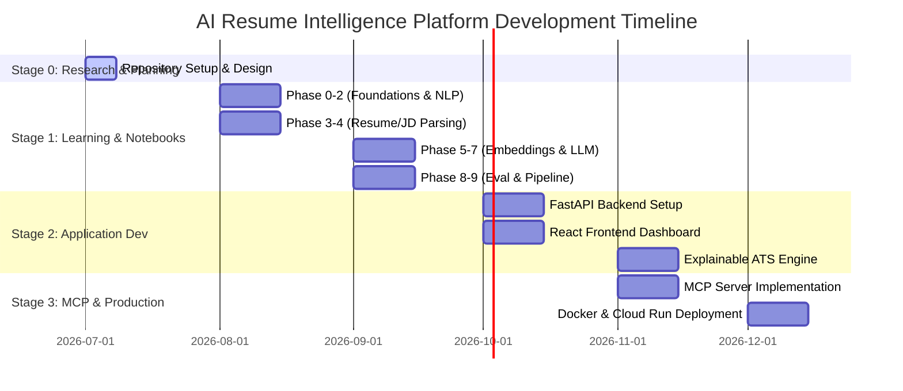

# AI Resume Intelligence Platform — Roadmap

This roadmap tracks the high-level milestones across the development stages of the project.

---

## 🗺️ Milestone Tracking

---

## 📍 Stage Breakdown

### Stage 0: Research & Planning (Completed)
- [x] Define executive objectives, success criteria, and non-goals.
- [x] Establish modular project folder structure.
- [x] Draft `README.md`, `PLAN.md`, `CHANGELOG.md`, and configuration templates.
- [x] Create directory initialization helper script.

### Stage 1: NLP Learning & Notebook Experiments (Active)
- [ ] **Phase 0 — Foundations**: Environment setup, Python refresher, Pandas/NumPy, Regex mastery.
- [ ] **Phase 1 — NLP Fundamentals**: Tokenization, Lemmatization, POS tagging, NER with spaCy.
- [ ] **Phase 2 — Text Representation**: TF-IDF, N-Grams, Word2Vec, Sentence Transformers.
- [ ] **Phase 3 — Resume Intelligence**: Parsing PDFs/Word docs, section mapping, education/experience extraction.
- [ ] **Phase 4 — Job Description Intelligence**: Requirements extraction, qualification detection, keyword ranking.
- [ ] **Phase 5 — Semantic Intelligence**: Similarity matching, FAISS and ChromaDB integration.
- [ ] **Phase 6 — Explainable ATS**: Rule engines, gap analysis scoring, explainable matches.
- [ ] **Phase 7 — LLM Engineering**: Prompting via OpenRouter, structured outputs, AI bullet points rewriter.
- [ ] **Phase 8 — Evaluation**: Precision/Recall verification, hallucination checkers.
- [ ] **Phase 9 — Production Pipeline**: Refactoring notebooks into production-ready Python modules.

### Stage 2: Application Development (Planned)
- [ ] **Backend (FastAPI)**:
  - Clean API design for uploading, parsing, scoring, and editing resumes.
  - Dependency injection for AI model service layer.
  - Structured output schemas with Pydantic.
- [ ] **Frontend (React)**:
  - Responsive design with TailwindCSS.
  - Interactive file uploader for Resumes & Job Descriptions.
  - Data visualizations showing matching criteria, skill gap analysis, and keyword scoring.
  - AI chat interface for interactive career coaching & bullet points rewriting.

### Stage 3: MCP & Production (Planned)
- [ ] Build standalone **Model Context Protocol (MCP)** server enabling AI assistants to run resume parsing & ATS score calculations.
- [ ] Set up **Docker** containers for backend, frontend, and database services.
- [ ] Deploy backend on **Google Cloud Run** and frontend on **Cloudflare Pages**.
- [ ] Establish **GitHub Actions** for CI/CD linting, testing, and automatic builds.
- [ ] Implement system logging and performance monitoring.
